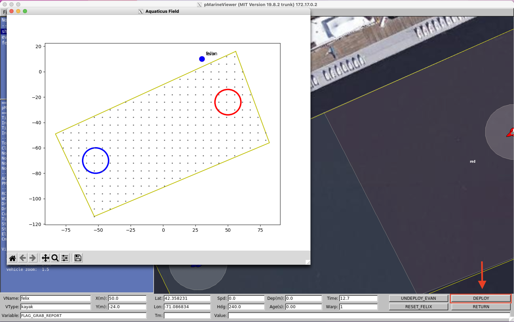
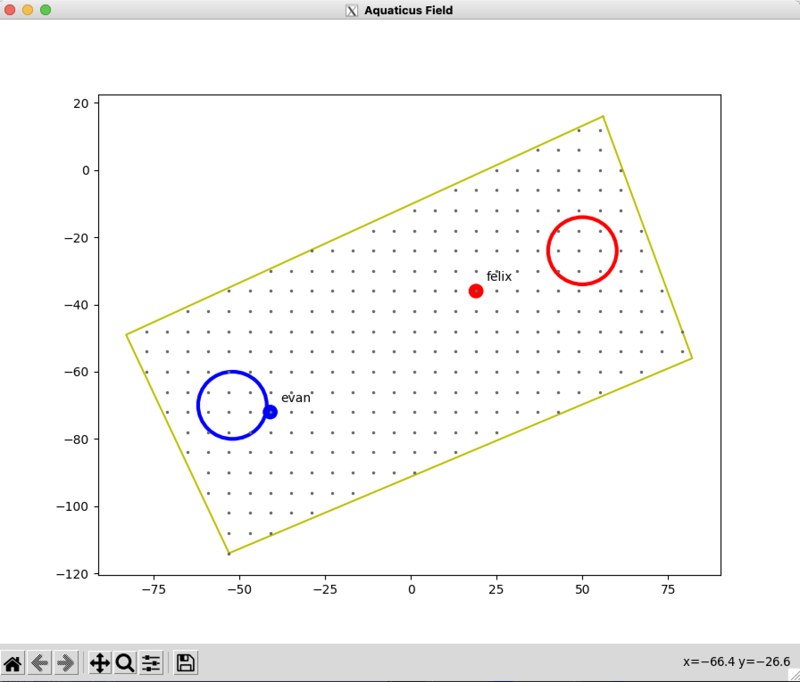

# Discretizer Example

This example is demoing both the `FieldDiscretizer` and `DiscreteFieldGrapher` classes from the `mivp_agent.aquaticus.field` module. Discretization for state is useful in many forms of ML.


Running the `DiscreteFieldGrapher` will slow down the program and is intended mainly for debugging. 

## Running

Use the launch script in this directory to run this example.

```
./run.sh
```

If your X11 forwarding is configured correctly you should see, both the MOOS-IvP simulation (pMarineViewer) and a matplotlib window appear. 

Once you are ready you can click the "DEPLOY" button as shown below.



## Explanation

By default, the X and Y position (`NAV_X` and `NAV_Y`) of MOOS vehicles are represented as floating point numbers and therefore resemble continuous numbers. But do we, or a model, really care about the difference between `x=5.9999` and `5.9998`? In most cases the difference between these two points is not helpful information. 

To keep things simple, we create a "discrete" grid of points which the simulated vehicles are "allowed" to be at. This grid can be seen below.



The gray dots are the discrete positions which the vehicles are mapped to (or "allowed" to be at). In reality the Evan and Felix vehicles are not actually on one of the gray dots. Instead they are mapped to the closest gray dot relative to their "true" position. 

This vastly simplifies the Aquaticus playing field and thus makes it an easier problem to solve and train models for. 

The number of points on this grid can be changed to train models which can "see" with different resolution. It is **important to run trained models** using a discretizer which has the same settings as the discretizer that model was trained with. This is why you can see the `field_res` parameter saved to disk in the `config.json` of every saved QTable model (example [here](https://github.com/mivp-agent/moos-ivp-agent/blob/main/examples/QTable/trained/1629507545_fine-dragon-39/config.json#L33)).

Read more about the python API for the field discretizer [here](https://mivp-agent.github.io/python/aquaticus/field_discretizer/).