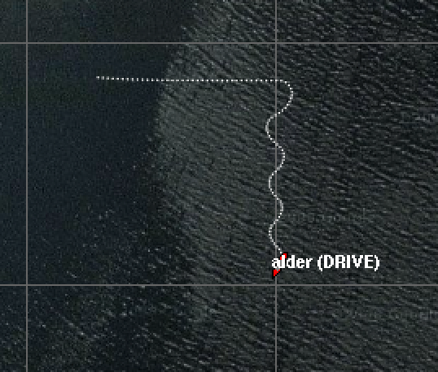

# ManagerExample

This is a basic example on how to use moos-ivp-agent's `BHV_Agent` behavior as a client to the `MissionManager` interface in python3.x

# Running the model and mission

**IMPORTANT NOTE:** These are intended to be run INSIDE the docker container that comes with this repository. See the [main README](../../README.md) for install / usage instructions. 

To launch the model **and** the simulation use the run script
```
./run.sh
```

To start `BHV_Agent` connection you must press the "DEPLOY" button in pMarineVewier.

After running, you should see the following behavior 


