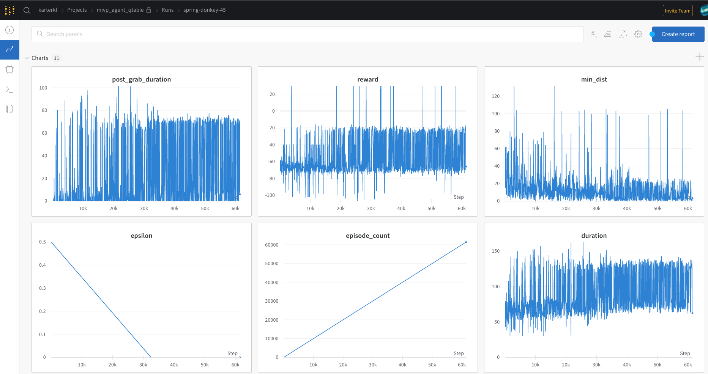

# moos-ivp-agent's QTable implementation

## Overview

### Model
This is an implementation of on policy [Q-Table learning](https://www.freecodecamp.org/news/an-introduction-to-q-learning-reinforcement-learning-14ac0b4493cc/). It uses the `FieldDiscretizer` utility provided by the `mivp_agent` to make the aquaticus field compatible with the Q-Table method.

## Mission files / MOOS-IvP details
The mission files being used are from the `../../missions/AgentAquaticus` base mission.

The config block, in `mission/heron/meta_heron.bhv`, that supports connection with `MissionManager` is `BHV_Agent` after the simulation is started this behavior will attempt connection to the server started by `MissionManager`.

The other important config block, in `mision/heron/plug_pEpisodeManager.moos`, facilitates episodic behavior. Note also, the flag manager config block in shoreside's `mission/shoreside/meta_shoreside.moos` specifies the success condition by a message sent to the `pEpisodeManager` via a posted MOOS var that it listens to.

The moos-ivp-agent apps `uFldFlagManagerAgent` & `uFldTagManagerAgent` (forks of the originals) to add support for multi-vehicle data collection during aquaticus simulations. They are backwards compatible with the original versions.

### Agent & results
Currently, the agent being trained to both capture **and** return the flag. Success is being seen at around 45000 episodes which amounts to approximately 24 hours and 50 days of training time from the agent's perspective (with all 5 agents running during training time). It is **highly** likely that better learning algorithms, such as DQNs, will generalize better and converge to optimal Q values faster.

## Training

### API Key
The QTable example integrates with the ML service [WandB](https://wandb.ai) for logging purposes. You must make a account with them and put your api key in `model/wandb_key.py`

### Running trainer
After making a WandB account and adding your key, you can start the trainer with the following command. This will launch both the simulator and the trainer.

```
./train.sh
```
 
**REALLY IMPORTANT NOTE:** If a majority of the first 20 or so episodes have `duration` values >= 200 (the maximum). See the section below and reduce the number of agents until this is not the case.
 
#### View wandb output
 
If correctly launched you should be able to go to [https://wandb.ai/home](https://wandb.ai/home) and see a project named `mivp_agent_qtable` on the left side. After clicking on this project, you should be able to see at least one "run" with an auto generated human-readable title.
 
When clicking on the run you should see a number of tabs, the main one being the graphs which should look similar to those below.
 

 
**NOTE:** This human-readable title will correspond to the save path name in the `trained/` directory.
 
### Tuning the amount of agents
Depending on your system, you will be able to run different amounts of agents. The maximum allowed in this example is five agents. To reduce the number we will need to make two edits

**NOTE:** The number of agents you are able to run will depend heavily on the current utilization of your computer (what other processes you are running).

#### First edit
Firstly we will edit the `model/trainer.py` file to comment out a pair of expected vehicles. This section is right below imports

```
# The expected agents and their enemies
VEHICLE_PAIRING = {
  'agent_11': 'drone_21',
  'agent_12': 'drone_22',
  'agent_13': 'drone_23',
  'agent_14': 'drone_24',
  #'agent_15': 'drone_25' <--- Comment out a line like this
}
EXPECTED_VEHICLES = [key for key in VEHICLE_PAIRING]
```

#### Second edit
Then, we need to comment out these vehicles `agent_15` and `agent_25` (in this example) in the `scripts/sim_launch.sh` file on TWO lines

```
cd ../mission/heron
  # Launch a agents
  ./launch_heron.sh red agent 11 --color=orange $LOGGING $TIME_WARP > /dev/null &
  ./launch_heron.sh red agent 12 --color=green $LOGGING $TIME_WARP > /dev/null &
  ./launch_heron.sh red agent 13 --color=purple $LOGGING $TIME_WARP > /dev/null &
  ./launch_heron.sh red agent 14 --color=gray $LOGGING $TIME_WARP > /dev/null &
  #./launch_heron.sh red agent 15 --color=yellow $LOGGING $TIME_WARP > /dev/null &
  # Notice this ^^^^ commented line

  # Launch a blue drone
  ./launch_heron.sh blue drone 21 --behavior=DEFEND --color=orange $LOGGING $TIME_WARP > /dev/null &
  ./launch_heron.sh blue drone 22 --behavior=DEFEND --color=green $LOGGING $TIME_WARP > /dev/null &
  ./launch_heron.sh blue drone 23 --behavior=DEFEND --color=purple $LOGGING $TIME_WARP > /dev/null &
  ./launch_heron.sh blue drone 24 --behavior=DEFEND --color=gray $LOGGING $TIME_WARP > /dev/null &
  #./launch_heron.sh blue drone 25 --behavior=DEFEND --color=yellow $LOGGING $TIME_WARP > /dev/null &
  # Notice this ^^^^ commented line also
cd ..
```

## Running models

### Directory structure
To run trained models we need to point it at the `.npy` file with the trained model which has a `config.json` file in the same folder as this file. For example:

```
- trained/
- my_cool_model/
  - config.json <-- required
  - 100.npy
  - 200.npy
  - ...
  - 3000.npy <--- what we point the run script at
```

### Running models
To launch a gui simulation and the model, we can use the following script syntax.

```
./run.sh --model trained/my_cool_model/3000.npy

```

**NOTE:** If run without a `--model` flag, the run script will run whatever model is defined by `DEFAULT_RUN_MODEL` in `model/constants.py`
Further, you can change the name of the "enemy" that your agent will look for by the following syntax

```
./run.sh --model trained/my_cool_model/3000.npy --enemy evan
```

This is helpful using trained agents in missions which they were not trained in.

## Debugging

### Debugging the simulation while training
The best way to begin debugging the simulation is to run a `uMAC` session on the compiled shoreside moos file after running the `./train.sh` script (while the simulation is running).

```
uMAC mission/shoreside/targ_shoreside.moos
```

**NOTE:** you might have to wait a short amount of time for shoreside to get a message from the vehicles.